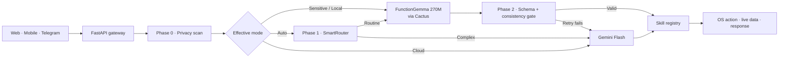

<p align="center">
  
</p>

<h1 align="center">SecureClaw</h1>

<p align="center">
  <strong>Private AI inference, by default.</strong><br />
  An action-taking AI agent that keeps sensitive requests on-device and reaches for the cloud only when the task calls for it.
</p>

<p align="center">
  <a href="#quick-start"></a>
  
  
  
</p>

> [!NOTE]
> SecureClaw was built at the Google DeepMind × Cactus Compute Hackathon. It is a working local-first prototype, not a production security boundary.

## What is SecureClaw?

SecureClaw is a hybrid AI agent for real-world actions: set an alarm, check the weather, create a reminder, find a contact, send a message, or play music. Before inference begins, a lightweight privacy layer classifies the request. Sensitive prompts stay on the device in **Auto** mode; ordinary prompts move through a two-phase router that balances local speed and privacy against cloud capability.

The product exposes the same routing idea across a React web app, an Expo mobile client, and a Telegram bot. Every response can show where inference ran, how confident the model was, and what privacy risk was detected. **Auto**, **Local**, and **Cloud** controls leave the final choice with the user.

## The routing contract

| Mode | What SecureClaw does | Data boundary |
| --- | --- | --- |
| **Auto + sensitive** | PII detection pins inference to FunctionGemma | Prompt stays on-device for inference |
| **Auto + routine** | SmartRouter attempts local inference, validates the tool call, and retries once if needed | Cloud is used only after a routing or validation escalation |
| **Local** | Skips cloud routing and runs FunctionGemma directly | No cloud-model request |
| **Cloud** | Sends the request to Gemini Flash for function calling | Prompt is sent to the configured Gemini API |

The privacy scanner recognizes email addresses, phone numbers, SSNs, Luhn-valid credit cards, addresses, dates of birth, passport references, passwords, and health or financial language. Results are classified as `low`, `medium`, or `high`; both `medium` and `high` select local inference in Auto mode.

> [!IMPORTANT]
> The Cloud override is explicit consent to cloud inference, even when PII is detected. Skill execution can also have its own network or operating-system side effects. SecureClaw's privacy routing governs model inference; it does not sandbox every downstream action.

## How it works



### Phase 0 — privacy before routing

The zero-dependency scanner runs before model selection. It combines format detection with contextual signals and validates card numbers with the Luhn algorithm. The `/api/privacy` endpoint can also return a redacted preview without invoking a model.

### Phase 1 — route by task shape

SmartRouter scores conjunctions, action verbs, tool count, query length, numeric arguments, and—when the optional embedding model is installed—semantic similarity to known hard requests. Straightforward work stays local; multi-action and complex requests can move to Gemini.

### Phase 2 — trust, then verify

Local output is checked against the available tool schema, required argument types, valid time ranges, empty values, and query/output consistency. Alarm and timer values can be corrected from the original request. Invalid output gets one local retry before cloud fallback.

## What it can do

| Area | Actions |
| --- | --- |
| **Personal automation** | Set alarms and timers, create reminders, play music |
| **Communication** | Search local contacts and send messages |
| **Live information** | Fetch current weather |
| **Extensible adapters** | Web browsing, sandboxed file operations, and local calendar CRUD are included in the registry |

The primary gateway currently exposes seven core actions to the inference pass. The extended browser, file, and calendar adapters are registered for the next routing pass but are not yet selected by the core model pipeline.

## Interfaces

| Surface | Experience |
| --- | --- |
| **Web** | React, Vite, and Tailwind UI with a responsive dot field, routing override, privacy badges, tool-call inspection, latency, and WebSocket updates |
| **Mobile** | Expo client with a two-step **Analyze → Execute** flow, configurable confidence threshold, tool selection, and Gemini/OpenClaw provider options |
| **Telegram** | Bot commands for `/auto`, `/local`, `/cloud`, `/privacy`, and `/skills`, with per-user routing state |

## Quick start

### Requirements

- macOS for the complete demo experience and native Calendar, Reminders, Contacts, Messages, notifications, and Music integrations
- Python 3.12 (required by the Cactus setup script)
- Node.js and npm
- A Gemini API key for Auto fallback or Cloud mode
- A Telegram bot token only if you plan to run the Telegram interface

### 1. Clone SecureClaw and Cactus

```bash
git clone https://github.com/pranavp311/secureclaw.git
cd secureclaw
git clone https://github.com/cactus-compute/cactus.git cactus
```

### 2. Build local inference and download the models

```bash
cd cactus
source ./setup
cactus build --python
cactus download google/functiongemma-270m-it --reconvert

# Optional: enables semantic similarity in SmartRouter
cactus download nomic-ai/nomic-embed-text-v2-moe --reconvert
cd ..
```

SecureClaw expects the local model at `cactus/weights/functiongemma-270m-it`. If the embedding model is absent, routing gracefully falls back to its non-semantic heuristics.

### 3. Install the app

```bash
pip install -r agent/requirements.txt
npm --prefix web install
npm --prefix web run build
```

### 4. Run the web app

```bash
export GEMINI_API_KEY="your-gemini-key"
./run_agent.sh server
```

Open [localhost:8000](http://localhost:8000). macOS may ask for permission the first time SecureClaw controls Calendar, Reminders, Contacts, Messages, notifications, or Music.

For frontend hot reload, use:

```bash
./run_agent.sh dev
```

The Vite client runs at [localhost:5173](http://localhost:5173) and proxies API and WebSocket traffic to the gateway on port `8000`.

## Try the privacy loop

Start in **Auto** mode and compare these request shapes:

```text
What is the weather in Singapore?

My email is person@example.com; set an alarm for 7:30 AM.

Find Jordan and send them a message saying I will be ten minutes late.
```

The first request is eligible for ordinary hybrid routing. The second is classified as sensitive and forced local. The third exercises the router's multi-action detection and can escalate to Gemini for a more reliable tool plan.

## API

| Method | Route | Purpose |
| --- | --- | --- |
| `POST` | `/api/chat` | Privacy scan, route, infer, and execute a skill |
| `GET` | `/api/skills` | List registered skill schemas |
| `POST` | `/api/privacy` | Classify and redact text without model inference |
| `GET` | `/api/health` | Return gateway and skill-registry health |
| `WS` | `/ws` | Real-time chat transport |

Example privacy check:

```bash
curl http://localhost:8000/api/privacy \
  -H 'Content-Type: application/json' \
  -d '{"text":"Email me at person@example.com"}'
```

## Optional clients

### Mobile

The mobile client uses the Flask analysis/execution API. Update `BASE_URL` in `mobile/src/api.ts` for your simulator or physical device, then run:

```bash
pip install flask
python server.py --port 5001

# In another terminal
npm --prefix mobile install
npm --prefix mobile start
```

### Telegram

```bash
export TELEGRAM_BOT_TOKEN="your-telegram-token"
export GEMINI_API_KEY="your-gemini-key"
./run_agent.sh telegram
```

## Repository map

```text
secureclaw/
├── main.py                 # Inlined SmartRouter + local/cloud inference
├── smart_router.py         # Standalone routing reference
├── benchmark.py            # Routing evaluation suite
├── agent/
│   ├── privacy.py          # PII classification and redaction
│   ├── server.py           # FastAPI gateway, WebSocket, skill execution
│   ├── telegram_bot.py     # Telegram interface
│   └── skills/             # OS, web, workspace, and calendar adapters
├── web/                    # React + Vite desktop web client
├── mobile/                 # React Native + Expo client
├── app/                    # Flask API used by the mobile flow
└── assets/                 # README and product artwork
```

## Evaluation

With Cactus built and the models available, run the local benchmark suite:

```bash
python benchmark.py
```

The benchmark covers single- and multi-tool requests, argument fidelity, routing accuracy, latency, and cloud fallback behavior. `submit.py` packages the same hybrid entry point for the hackathon leaderboard.

## Privacy and safety

SecureClaw is designed to make its inference boundary visible, but the current implementation is still a prototype:

- PII detection is heuristic and can produce false positives or miss sensitive context.
- The gateway uses permissive CORS and has no authentication; run it only on a trusted local network.
- Local inference is serialized because the Cactus C runtime is not thread-safe in this integration.
- Native action skills depend on macOS automation permissions and should be reviewed before real-world use.
- The web tool-selection sheet is currently presentational; the primary gateway selects from its server-side core tool set.
- The mobile API base URL is configured in source and must be changed for each development environment.

Before production use, add authentication, encrypted state, explicit network policy, scoped skill permissions, audit logs, stronger PII detection, and adversarial routing tests.

## Hackathon

SecureClaw was created for the **Google DeepMind × Cactus Compute Hackathon** as an exploration of a simple idea: an AI agent should not have to choose between useful actions and a legible privacy boundary.

The generated hero artwork uses SecureClaw's own black, graphite, orange, green, and indigo design tokens. The protected local core and the deliberately narrow cloud filament mirror the product's routing model.
